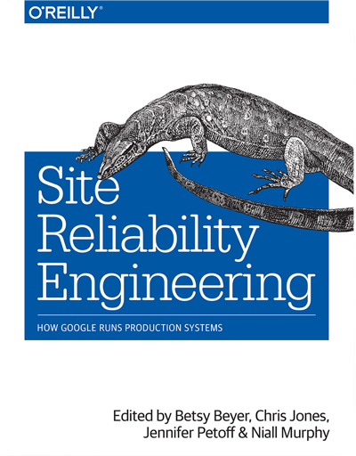
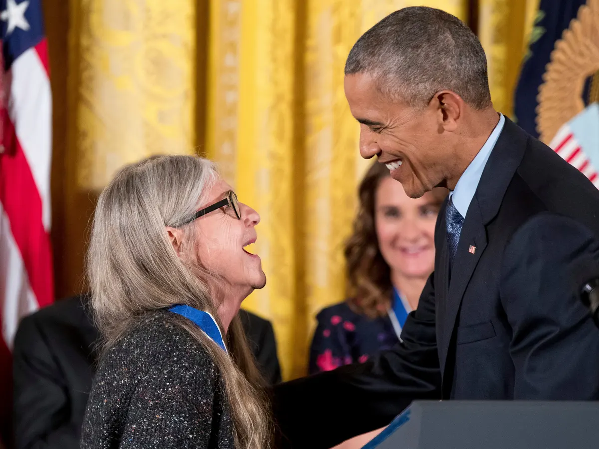

Hace unas semanas fui invitado al [podcast "Había una vez un Algoritmo"](https://algoritmo.buzzsprout.com) de [Camilo Chacón Sartori](https://camilochs.github.io/web/) (
pueden escuchar la entrevista en este link: https://algoritmo.buzzsprout.com/758831/10810042).

Durante la entrevista Camilo me preguntó por algún personaje, del mundo de la informática, que admirara. Y ponderando diversas alternativas  expresé mi admiración creciente por [Margaret Hamilton](https://en.wikipedia.org/wiki/Margaret_Hamilton_(software_engineer)). 

Me resultó curioso que Camilo expresara que no sabía mucho sobre ella, pero la verdad es que es casi seguro que quienes sepan algo de Margaret Hamilton sea en relación a esta fotografía:

En la imagen la vemos parada junto al listado impreso del código fuente del Apolo. Esta foto ha sido compartida miles de veces en redes sociales, pero sospecho que no se ahonda mucho más del hecho de que ella programó ese código (por supuesto ella no estaba sola, dirigía el equipo de software que lo hizo).

Puede que aquellos, que han ahondado un poco más, sepan que es una de las personas a las que se le atribuye el origen del término "Ingeniería de Software"[^1]. Al respecto ella dice:

> Cuando se me ocurrió el término por primera vez, nadie había oído hablar de él antes, al menos en nuestro mundo. Fue una broma constante durante mucho tiempo. Les gustaba bromear sobre mis ideas radicales. Fue un día memorable cuando uno de los gurús de hardware más respetados les explicó a todos, en una reunión, que estaba de acuerdo conmigo en que el proceso de creación de software también debería considerarse una disciplina de ingeniería, al igual que con el hardware. No por su aceptación del nuevo 'término' per se, sino porque nos habíamos ganado su aceptación y la de los demás en la sala como parte de un campo de ingeniería por derecho propio.

Pero la contribución de Margaret Hamilton es mucho más profunda de lo que muchos sospechan.

En una reseña elaborada por la NASA en ocasión de un reconocimiento que le hicieron por sus contribuciones al software del Apolo se dice:

>"El software de vuelo del Apolo fue uno de los ejemplos más tempranos y significantes del desarrollo de software de vuelo tal como lo conocemos hoy. Fue un esfuerzo pionero el que se ejecutó para el Apolo. Los conceptos desarrollados llegaron a ser los fundamentos de la moderna "ingeniería de software", un término acuñado por Ms. Hamilton, e inmediatamente encontró uso más allá del Apolo en el Skylab y el Transbordador Espacial. Sus conceptos de software asíncrono, "priority scheduling", reutilización del software, y las capacidades para que una persona participe en el ciclo de decisiones ("man-in-the-loop" decision capability), tales como las pantallas de prioridades, se convirtieron en las fundaciones del software ultra confiable.
>
>Se pueden citar muchos ejemplos de implementación exitosa en el Apolo. El ejemplo más importante es del Apolo 11. El 20 de julio de 1969, tres minutos antes de que el Águila tocara la superficie lunar, 212 / 5.000 el software anuló un comando para cambiar el procesamiento de prioridad de las computadoras de vuelo a un sistema de radar cuyo interruptor de "encendido" se había activado manualmente, debido a un script de operaciones defectuoso que se le proporcionó al piloto. Si la anulación del software no hubiera estado activa, preprogramada, probada y simulada, el aterrizaje del LEM podría haberse abortado o el LEM podría haberse estrellado ese fatídico día, posiblemente matando a los astronautas y poniendo en peligro el programa de vuelo espacial tripulado. 
>    
> El código de 40.000 líneas del LEM[^2] y su homólogo para los módulos de servicio y comando, se escribieron bajo contrato por el Charles Stark Draper Labs, bajo el control directo del diseño de la Sra. Hamilton. Sus ideas únicas incluían: pantallas de prioridad, establecimiento de requisitos estrictos en la ingeniería de todos los componentes y subsistemas para eliminar errores de interfaz con el software de vuelo a nivel de sistema, depuración de todos los componentes y pruebas antes del ensamblaje, y simulación de todas las situaciones imaginables a nivel de sistemas antes dando cuenta del código. Esto hizo posible identificar posibles anomalías y dio como resultado un código ultra confiable. Nunca se encontró algún fallo de software en ninguna misión Apolo de vuelo espacial tripulado. Ella exigió que el código de vuelo se diseñara para que funcionara bien la primera vez: "No hay una segunda oportunidad". Apolo vive hoy y continúa impactando el mundo moderno en parte a través de las muchas innovaciones creadas y defendidas por la Sra. Hamilton.

Hamilton, con la experiencia ganada, y con las ideas que forjó en el proyecto Apolo, fundó dos compañías de software, "High Order" en 1976, y "Hamilton Technologies" en 1986. Sus metodologías han sido usadas exitósamente en diversos proyectos gubernamentales norteamericanos.

En el prefacio del libro ["Site Reliable Engineering"](https://sre.google/sre-book/table-of-contents/), editado por un grupo de ingenieros de Google, ellos la homenajean declarando que Hamilton sería la primera SRE (Site Reliability Engineer):

> Nos gusta pensar que Margaret Hamilton, trabajando en el programa Apollo cedida por el MIT, tenía todos los rasgos significativos del primer SRE. En sus propias palabras, “parte de la cultura era aprender de todos y de todo, incluso de lo que uno menos esperaría.”
>
> Un ejemplo de ello fue cuando su pequeña hija Lauren vino a trabajar con ella un día, mientras algunos miembros del equipo ejecutaban escenarios de misión en la computadora de simulación híbrida. Como hacen los niños pequeños, Lauren salió a explorar y provocó que una "misión" fallara al seleccionar las teclas DSKY de una manera inesperada, lo que alertó al equipo sobre lo que sucedería si el programa de prelanzamiento, P01, fuera seleccionado inadvertidamente por un astronauta real. durante una misión real, durante la mitad del camino real. (Lanzar P01 sin darse cuenta en una misión real sería un gran problema, porque borra los datos de navegación y la computadora no estaba equipada para pilotar la nave sin datos de navegación).
>
>Con instinto de SRE, Margaret envió una solicitud de cambio de programa para agregar un código especial de verificación de errores en el software de vuelo a bordo en caso de que un astronauta, por accidente, seleccionara P01 durante el vuelo. Pero este movimiento fue considerado innecesario por los "superiores" de la NASA: por supuesto, ¡eso nunca podría suceder! Entonces, en lugar de agregar un código de verificación de errores, Margaret actualizó la documentación de especificaciones de la misión para decir el equivalente a "No seleccionar P01 durante el vuelo". (Aparentemente, la actualización fue divertida para muchos en el proyecto, a quienes se les había dicho muchas veces que los astronautas no cometerían ningún error; después de todo, fueron entrenados para ser perfectos).
>
> Bueno, la protección sugerida por Margaret solo se consideró innecesaria hasta la próxima misión, en el Apolo 8, solo unos días después de la actualización de las especificaciones. Durante la mitad del cuarto día de vuelo con los astronautas Jim Lovell, William Anders y Frank Borman a bordo, Jim Lovell seleccionó P01 por error, durante el día de Navidad, creando muchos estragos para todos los involucrados. Este fue un problema crítico, porque en ausencia de una solución alternativa, la falta de datos de navegación significaba que los astronautas nunca regresarían a casa. Afortunadamente, la actualización de la documentación mencionó explícitamente esta posibilidad y fue invaluable para descubrir cómo cargar datos utilizables y recuperar la misión, sin mucho tiempo libre.
>
> Como dice Margaret, "una comprensión profunda de cómo operar los sistemas no fue suficiente para evitar errores humanos", y poco después se aprobó la solicitud de cambio para agregar software de detección y recuperación de errores al programa de prelanzamiento P01.

En 2016 Barack Obama le otorgó la Medalla de la Libertad, el más alto reconocimiento civil que se entrega en Estados Unidos.
"“Ella simboliza esa generación de mujeres anónimas que ayudaron a enviar a la humanidad al espacio", dijo el presidente cuando le entregó la medalla.

Cuando le preguntaron sobre qué lecciones de aquella época pueden aplicar los programadores hoy[^3], su respuesta fue:

> Recientemente hemos visto sistemas en los que un avión se estrelló y el piloto no tenía idea de lo que estaba pasando. ¡Es una buena idea que el piloto sepa cuáles son sus opciones! Además, lo que se hizo evidente con Apolo, aunque no es cómo funcionó, es que es mejor definir su sistema por adelantado para minimizar los errores, en lugar de producir un montón de código que luego debe corregirse con parches en los parches. Es un mensaje que parece haber pasado desapercibido: en este sentido, el software de hoy todavía se construye de la misma manera que hace 50 años.

[^1]: De acuerdo a esta reseña de la NASA: https://www.nasa.gov/pdf/251093main_The_NASA_Heritage_Of_Creativity.pdf. La autoría del término se le atribuye también a Anthony Oettinger y Barry Boehm.
[^2]: Lunar Excursion Module, Módulo de Excursión Lunar, llamado Águila en el caso del Apolo 11.
[^3]: Entrevista en The Guardian: https://www.theguardian.com/technology/2019/jul/13/margaret-hamilton-computer-scientist-interview-software-apollo-missions-1969-moon-landing-nasa-women
