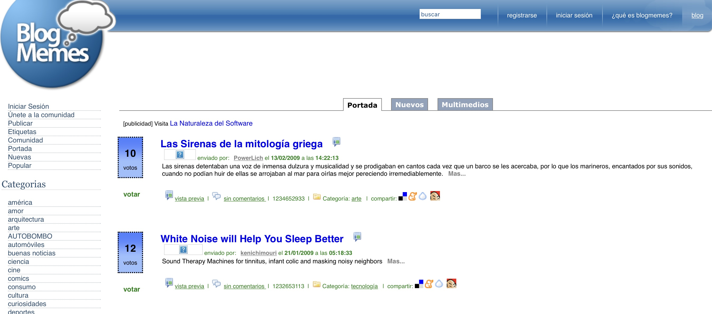

Hoy me levanté con todo el ánimo de escribir. Han pasado casi cuatro meses desde [la última entrada](blog/lnds/2022/07/24/margaret-hamilton-la-primera-sre/) en este blog.

Así que me dirigí a la terraza para sentarme a escribir y el primer problema fue que nuestra mesa estaba ocupada con tierra, maceteros y suculentas, que mi señora está preparando. OK, no hay espacio, me acomodaré en otra parte.

Luego de preparar el café y procrastinar un rato en Twitter, para terminar leyendo algo sobre los asteroides troyanos de Júpiter, recuerdo que mi idea era ponerme al día con el blog, así que levanto la tapa de mi laptop. 

Voy a la carpeta donde tengo los textos de mi blog y ejecuto la rutina de siempre:

    $ git pull --rebase
    $ hugo -w server

Y en vez de tener mi blog corriendo como corresponde, Hugo me responde con un horrible error que termina con este texto:

    fatal: failed to expand user dir in: '~/.gitignore'

¡Qué *!&/$%!, pasó ahora!

Casi una hora perdida en búsquedas en Google, foros, páginas en GitHub, una reinstalación fallida de Hugo y [WowChemmy](https://wowchemy.com) para encontrar esto, en una [oscura referencia en un "thread" en GitHub](https://github.com/phpro/grumphp/issues/105):

    Maybe it's also easier to just brew install git ?

Mmmmm. 

Resulta que instalé la actualización de Mac OS Ventura, y es típico que las "developers tools" quedan chasconas con este tipo actualizaciones. Así que reinstalamos XCode y vemos si está la clásica opción de instalar las developers tools, quizás eso resuelva el problema...

Pero no. Eso no funcionó. Así que intento probar el consejo publicado por [@Veweee](https://github.com/veewee) en 2016 en el "thread" que les mencioné:

    $ brew install git

Por supuesto, después de eso Hugo empezó a funcionar de las mil maravillas.

Gracias [@Vewee](https://github.com/veewee), dondequiera que estés.

Al fin pude levantar Hugo:

    $ hugo new --kind post post/2022-11-05-lo-que-hemos-olvidado-sobre-internet

    $ code .

Y al fin pude empezar a escribir.

Ahora, más de alguno se preguntará por qué tanta complicación.

Para entenderlo les tengo que explicar cómo publico mi blog.

1. El contenido de mi blog está en el formato [Markdown](https://es.wikipedia.org/wiki/Markdown), para ser más preciso, en una variante soportada por [Hugo](https://gohugo.io)
2. Los archivos Mardown son simples archivos de texto, pero tienen un lenguaje de marcado que permite configurar su aspecto de manera relativamente sencilla. Es como [LaTeX](https://lnds.net/blog/lnds/2008/01/14/latex/), pero mucho más simple (y en mi opinión igual y quizás más poderoso)
3. [Hugo](https://gohugo.io) es la herramienta que uso para convertir estos archivos Markdown en archivos HTML que pueden ser publicados después en cualquier parte. Hugo es lo que se conoce como un generador de contenido estático, y es un gestor de contenidos muy útil porque este modo permite obtener el mejor desempeño posible en un sitio web con contenido estático (como los sitios de noticias, blogs, o páginas de información empresarial). Si tu contenido no va a variar demasiado es la mejor alternativa, mucho mejor que otros [CMS](https://es.wikipedia.org/wiki/Sistema_de_gestión_de_contenidos) como [WordPress](https://wordpress.com) o [LifeRay](https://www.liferay.com) (horror, en serio, no uses Liferay, hazlo por el planeta) 
4. Mi idea es gestionar yo mi contenido. No quiero emplear plataformas gratuitas o que te amarran, como Medium, por ejemplo. 
5. Como el contenido de mi blog son archivos de texto, puedo versionarlo empleando GIT, de ese modo lo puedo publicar en cualquier parte, en particular lo tengo en GitHub en este repo: https://github.com/lnds/lnds-site. Si un día me enojo con GitHub todo mi contenido lo muevo a otro lado. En realidad esto ya lo hago, porque tengo una copia que se respalda automáticamente en GitLab: https://gitlab.com/lnds/lnds-site
6. Así que mi contenido está respaldado, es público y no está amarrado a los caprichos de los dueños de Medium, por ejemplo, o de cualquier otra plataforma donde pudiera alojarlo.
7. Ahora está el problema del [Hosting](https://www.hostinger.es/tutoriales/que-es-un-hosting). Dado que el volumen de tráfico de mi blog es bajo, uso los servicios de [Netifly](https://www.netlify.com). Si este sitio llegara a explotar en tráfico (eso no va a pasar, no sueñes Edo), puedo subir al servicio pagado. Y si los dueños de Netlify se ponen cabrones me cambio de proveedor o instalo el contenido en un Ngnix en cualquier parte.

Al final lo que obtengo es libertad de verdad (no de esa de la que hablan los libertarios, hablo de la real). 

# Libertad Digital

La libertad en el mundo digital la tienen quienes tienen el dominio de la tecnología. 

Hoy uso Hugo, pero si quiero puedo construir mi propio generador HTML (no es tan difícil, si sabes cómo). De hecho, en un momento escribí mi [propia plataforma de blogging](https://github.com/lnds/prosa-blog-server), y este blog estuvo alojada allí por lo menos un par de años.

Teniendo tiempo, el que sabe programar y domina lo básico de la gestión de la infraestructura de la web, puede crear lo que sea. Y eso le da libertad, una libertad y un poder enorme en el mundo digital.

El resto tiene que utilizar servicios. 

Lo bueno que hay muchos servicios gratuitos (en inglés emplean el término «free» que también significa «libre»). Pero como dice un adagio antiguo de internet: «si el producto es gratis, entonces tú eres el producto».

Así que el programador moderno tiene esta gran libertad, y con ella un gran poder, pero como dijo el Tio Ben: «con todo gran poder viene una gran responsabilidad».

# Agregadores Sociales

Corría el año 2005 y todos estábamos publicando blogs. Lo que llevó  al surgimiento de un tipo especial de aplicaciones, los «Social News Aggregators», o sitios dedicados a la curación y divulgación de contenido publicado en páginas webs.

Era el tiempo de aplicaciones como [SlashDot](http://slashdot.org), creado por [Rob Malda](https://en.wikipedia.org/wiki/Rob_Malda) o [Digg](https://digg.com) de [Kevin Rose](https://lnds.net/blog/lnds/2006/01/23/una-entrevista-con-el-fundador-de-digg-com/).

Estas eran como una suerte de redes sociales primitivas, o proto-social-networks. Si bien Facebook existía, aún era algo cerrado a las universidades y no era exactamente del mismo tipo.

La idea era compartir contenido interesante, la gente publicaba un texto breve y el link al sitio que quería promover. Mediante una mezcla de votos y algoritmos de selección, el contenido llegaba a ocupar las primeras páginas.

Inspirado por esos sitios fue como en diciembre del 2005 lancé [BlogMemes](https://lnds.net/blog/lnds/2005/12/07/blog-memes/). Ese proyecto a su vez era la evolución a su vez de otro proyecto llamado [America Escribe](http://web.archive.org/web/20060319054125/http://www.americaescribe.org/).

También en ese tiempo surgió en España otro sitio, llamado [Menéame](https://www.meneame.net).

Dediqué varios meses a BlogMemes en mi tiempo libre, y el sitio llegó a tener sobre 40.000 usuarios, si recuerdo correctamente. Pero yo no tenía tiempo para seguir dedicándole, y un sitio como este requiere mucho trabajo.
Descubrí que construir un sitio "social" en internet es una gran responsabilidad.

Sólo por nombrar los aspectos más críticos, tenía que preocuparme de cosas como:

- Los spammers
- Publicación de sitios que podrían ser nocivos o ilegales
- Peleas de los usuario porque consideraban que su sitio requería más promoción
- Hackeos
- Etc

No me sentí con el ánimo para seguir, así que decidí vender el sitio (por una cifra ridícula) y el derecho a usar Blogmemes a un colaborador francés del proyecto y lo abandoné.

# Redes Social

También ocurrió que las personas empezaron a abandonar sus blogs porque decidieron migrar a Facebook, y después a Twitter.

Se impuso la moda del «micro blogging», y los blogs quedaron limitados a unos pocos entusiastas.

Y así empezaron los problemas.

Porque cuando dejas que una plataforma gestione tu contenido ya deja de ser tuyo, es de la plataforma.

Muchos bloggers me decían que en Facebook lograban más atención, así que empezaron a privilegiar esa plataforma.

El problema es que eso de lograr mayor atención es una trampa.

Si no me creen, pueden leer este interesante artículo en Wikipedia titulado ["Pivot To Video"](https://en.wikipedia.org/wiki/Pivot_to_video). Esta idea, alimentada por Facebook, generó despidos y la caída de varios medios, que sacrificaron la propiedad de su contenido en aras de la mayor atención, sobre todo de las nuevas generaciones.

Esta idea de que la gente no quiere leer más, o que busca contenido corto o visual, es en realidad un producto de las tendencias explotadas por empresas como Facebook.

Hoy unos pocos se espantan porque Elon Musk toma el control de Twitter. El empresario dice que lo hace en el nombre de la libertad de expresión, cuando en realidad quiere controlar la discusión, eliminando todo aquello que no le gusta. Y si pueden controlar la conversación es porque les hemos dejado hacerlo.

Cada vez que tu contenido lo expones en una plataforma estás entregándolo a esa plataforma, sea esta Medium, Facebook o Twitter. Tus tweets ya no son tuyos, tus entradas en tu muro tampoco.

Igual no puedes evitar tener presencia en esas redes, después de todo, si manejas tu contenido, como en mi caso, igual necesitas que la gente llegue a este. Esa era la idea de los «social news aggregators», pero ese sistema falló, solo algunos pocos siguen siendo útiles, porque son consumidos por comunidades más restringidas (pienso en [hacker news](https://news.ycombinator.com)).

Quizás la solución sea volver a los orígenes de la web, y recordar que la red es un [mundo de extremos](https://lnds.net/blog/lnds/2008/06/30/un-mundo-de-extremos/):

  Cuando se trata de la Red, muchos  sufrimos del **Síndrome del Error Repetitivo**. Esto es especialmente cierto para los editores de diarios y revistas, radio y televisión, televisión por cable, la industria discográfica, la industria cinematográfica y la industria telefónica, por nombrar solo a seis.

  [...]
  
  “Internet interpreta la censura como una falla y la esquiva rodeándola”, según una famosa frase de [John Gilmore](http://www.toad.com/gnu/). Y es verdad. A la larga, la radio de Internet tendrá éxito. Los sistemas de mensajería instantánea inter operarán. Las compañías bobas se volverán listas o morirán. Las leyes estúpidas serán matadas o reemplazadas. Pero entonces, como dijo John Mainard Keynes, “a la larga, todos estamos muertos”.

  Todo lo que necesitamos hacer es poner atención a lo que realmente es Internet. No es difícil. La Red no es ingeniería espacial. No es ni siquiera ciencia de sexto grado. Podemos poner fin a la tragedia del Síndrome del Error Repetitivo durante nuestras vidas y economizar unos cuantos billones de dólares en decisiones tontas, si solamente recordamos un hecho simple: la Red es **un mundo de extremos**. Usted está en un extremo; todo y todos los demás están en los otros extremos.

  Seguro, esta es una declaración simplista que afirma que todo el mundo tiene valor en la Red. Pero es también el hecho más básico y sólido sobre la arquitectura técnica de la Red. Y el valor de Internet se basa en su arquitectura técnica.

  Afortunadamente, la verdadera naturaleza de Internet no es difícil de entender. De hecho, solo un puñado de afirmaciones se encuentran entre el Síndrome del Error Repetitivo y la Iluminación.

  1. Internet no es complicada
  La idea detrás de Internet, en primer lugar, fue aprovechar el asombroso poder de la simplicidad, tan simple como la gravedad en el mundo real. Excepto que en vez de mantener pequeñas piedras sujetas a una gran piedra redonda, Internet fue diseñada para mantener pequeñas redes juntas, transformándolas en una gran red.

  La forma de hacer esto fue hacer fácil, fácil, fácil para las redes el enviar y recibir datos hacia y desde otra red. Por lo tanto, Internet fue diseñada para ser la forma más simple concebible para enviar bits desde cualquier A hacia cualquier B. 

  2. Internet no es una cosa. Es un acuerdo

  Cuando miramos los postes, vemos a las redes como cables. Y vemos a esos cables como partes de sistemas: el sistema telefónico, el sistema de alimentación eléctrica, el sistema de televisión por cable.

  Cuando escuchamos la radio o miramos televisión, se nos dice en cada corte que las redes son fuentes de programación que es transmitida a través del aire o de los cables.

  Pero Internet es diferente. No es un cableado. No es un sistema. Y no es una fuente de programación.

  Internet es una forma para que todas las cosas que se dicen redes coexistan y trabajen de manera conjunta. Es trabajo entre-redes (inter-network, en inglés). Literalmente.

  Lo que hace que sea una inter-red es el hecho de que Internet es simplemente un protocolo: el Internet Protocol, para ser más exactos. Un protocolo es un acuerdo sobre como las cosas trabajan juntas.

  Este protocolo no especifica qué puede hacer la gente con la red, qué puede construir en sus bordes, qué puede decir, quién puede hablar. El protocolo simplemente dice: si usted quiere intercambiar bits con otros, así es como debe hacerlo. Si usted quiere poner una computadora o un teléfono celular o un refrigerador en la red, tiene que aceptar el acuerdo que es Internet.

  3. Internet es estúpida

  El sistema telefónico, que no es Internet (al menos no aún), es terriblemente listo. Sabe quién está llamando a quién, donde están ubicados, si es una llamada de voz o de datos, qué tan lejos llega la llamada, cuánto cuesta, etc. Y provee servicios que solo tienen que ver con una red telefónica: llamada en espera, identificador de llamada y otras muchas cosas que a las compañías telefónicas les gusta vender.

 Internet, por otra parte, es estúpida. A propósito. Sus diseñadores se aseguraron de que la red más grande e inclusiva de todas sea tan tonta como una caja de piedras.

  Internet no sabe muchas cosas que una red inteligente, como la telefónica, conoce: identidades, permisos, prioridades, etc. Internet sólo sabe una cosa: este montón de bits necesita ir desde un extremo de la Red hasta otro.

  Hay motivos técnicos por los cuales la estupidez es un buen diseño. La estupidez es robusta. Si un ruteador falla, los paquetes se rutean esquivándolo, lo que significa que la Red sigue de pie. Gracias a la estupidez, la Red acoge nuevos dispositivos y gente, de manera que crece rápidamente y en todas las direcciones. También es fácil para los arquitectos incorporar capacidades de acceso a la red en todo tipo de dispositivos inteligentes -- filmadoras, teléfonos, regadores de jardín -- que viven en los extremos de la Red.

  La razón más importante por la que la estupidez es buena tiene poco que ver con la tecnología y mucho con el valor…

  4. Agregar valor a Internet disminuye su valor

  Suena extraño, pero es cierto. Si usted optimiza una red para un tipo de aplicación, la empeora para otros. Por ejemplo, si usted deja que la red dé prioridad a los datos de voz o vídeo, asumiendo que necesitan llegar más rápidamente, le está diciendo a otras aplicaciones que deberán esperar. Y ni bien haga eso, habrá transformado la Red de algo simple, para todos, en algo complicado, solo para un propósito. Ya no es Internet.

  5. Todo el valor de Internet crece en sus bordes

  Si Internet fuese una red inteligente, sus diseñadores hubieran anticipado la importancia de un buen buscador y hubieran incorporado capacidades de búsqueda dentro de la misma Red. Pero dado que sus diseñadores fueron listos, hicieron a la Red muy estúpida para eso. Por lo tanto, las búsquedas son un servicio que puede ser construido en uno de los millones de extremos de Internet. Dado que la gente puede ofrecer cualquier servicio que desee desde su extremo, los buscadores compiten, lo que se traduce en alternativas para los usuarios y asombrosa innovación.

  Los buscadores son solo un ejemplo. Dado que Internet mueve bits desde un extremo hasta otro, los innovadores pueden construir cualquier cosa que imaginen, contando con Internet para mover los datos por ellos. Usted no tiene que preocuparse por obtener permisos de los dueños de Internet o los administradores de sistemas o del Vice Presidente del Servicio de Prioritización. ¿Usted tiene una idea? Realícela. Y cada vez que lo haga, el valor de Internet crecerá.

  Internet fue creada como un mercado libre para la innovación. Esta es la clave del valor de Internet. 

El problema está en que hemos olvidado estas cosas y hemos dejado que unos pocos controlen los accesos a los extremos.

El texto anterior fue escrito en 2003 por Doc Searls y David Weinberger y pueden encontrarlo completo y traducido acá: https://lnds.net/blog/lnds/2008/06/30/un-mundo-de-extremos/

En ese texto los autores dicen que hay tres reglas básicas de internet que le dan su poder:

  - Nadie la posee
  - Todos pueden usarla
  - Cualquiera puede mejorarla

Y eso se nos ha olvidado, por desgracia.

    $ git add content resources
    $ git commit -m "lo que hemos olvidado sobre internet"
    $ git push

